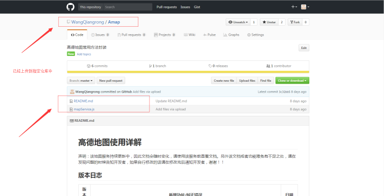

#npm包上传实操教程

##步骤概览：
```

1. 安装nodeJS

2. 注册一个github账户用于托管代码

3. 注册一个npm账户

4. 开发你的module，更新至github

5. 发布module至npm

6. 使用包

7. 补充
```

###1.nodeJs安装不多赘述

###2.注册GitHub账号并创建相应仓库用于托管模块或组件代码

####a.注册先不多赘述

####b.新建仓库

```
step1:
```


```
step2:
```


###3.注册npm账号

```
step1:(注册过程不多赘述)
```


```
step2:(注册好后登录账号，你会看到你的账号中的组织信息和上传包数量信息)
```


###4.开发你的module，更新至github

####a.新建你的开发文件夹


####b.在你的开发文件夹下开发你的模块


####c.把你开发的模块代码上传到你刚才新建的GitHub仓库（怎么上传到GitHub自己搞定咯）



###5.发布module至npm（好了，终于可以发布作品了）

####a.进入开发文件夹打开命令行工具

```
备注：这里是用过sublime安装的terminal插件右键进入命令行工具的，你也可以自行找到开发文件夹，在文件夹下按住shift件+右击，

选择“在此处打开命令窗工具”
```


####b.输入命令初始化npm上传包


####c.运行：（跟着系统提示输入必要的相关信息）

```
信息释义：

name：你的上传包名称

version：你的包版本（注意：只要是你已相同的包名称上传，那么后续上传的时候版本号必须要高于上一次上传的版本号）

description：你对包的描述（可选）

entry point：包的入口

test command：测试命令（可选）

git repository：你开发模块的GitHub仓库地址

keywords：关键字（可选）

license：使用默认即可（直接enter跳过）

```


####d.准备上传包

#####1'.命令行登录npm账号---->输入npm login-->依次填写三个信息即可登录

```
信息释义：

username：你的npm账号（必填）

password：你的npm密码（真实情况是无法输入的，但你要输入任意字符后再回车即可进行到下一步）

email：你npm绑定的邮箱（必填）
```


#####2'.查看是否登录npm：输入npm who am i 命令


####e.发布，输入npm publish命令，看到下面结果说明发布成功


####f.去npm官网查看已发布的包：（至此你的包便发布成功了）


###6.使用上传的包

```
进入一个新的目录--->打开命令行工具--->输入npm install 包名称 --save

如：npm install wqr-amap --save
```

**注意事项：**
```
包名称不能与现有可搜索到的包名称相同，见下例：（把报名处改成amap）
```

#####1.报错，提示没有权限，说明该包名称已经被使用了（那就能只换名称咯）


#####2.修改包名称


###7.补充

####1.下架已发布包：输入命令：npm unpublish 包名称@包版本

```
如：npm unpublish wqr-amap@1.0.0
```

####2.更新包版本：输入命令：npm version 版本号

```
如：
```


```
然后就愉快的发布新版本
```


